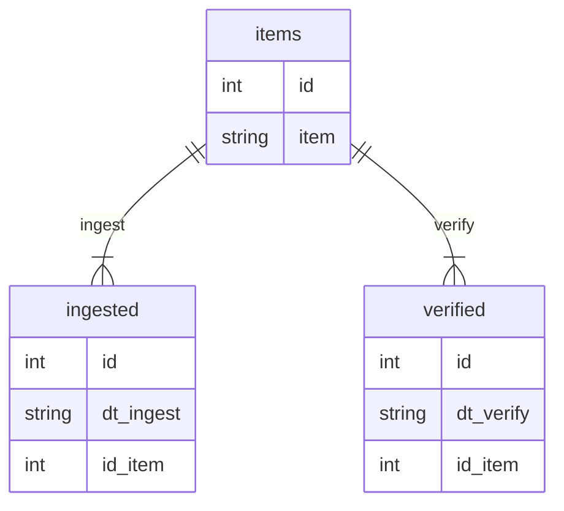

# Repository to Preservica Database

Creating a simple [SQLite3](https://www.sqlite.org/index.html) database to store the ingested items.

## Creating the database

The three SQL scripts can be executed directly from sqlite3 prompt to create the tables. Below is a simple diagram of how the tables are related.

