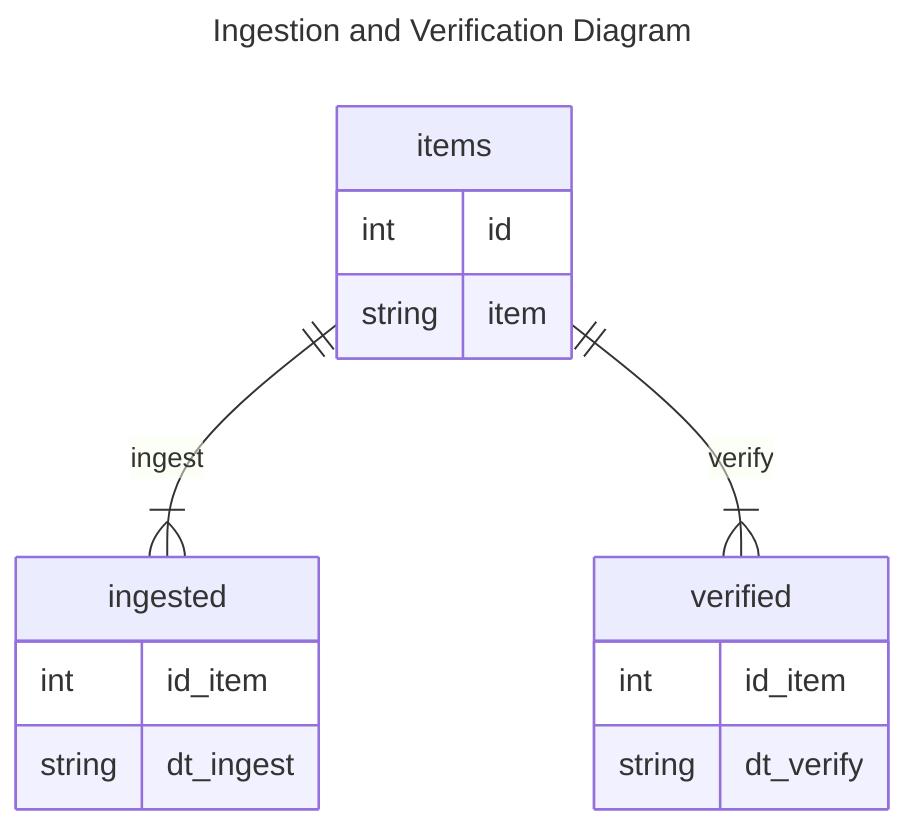

# Repository to Preservica Database

Creating a simple [SQLite3](https://www.sqlite.org/index.html) database to store the ingested items.

Below is a simple [ER diagram](https://mermaid.js.org/syntax/entityRelationshipDiagram.html) of how the tables are related.



## Creating the database

To create the database from the SQL files, execute the `createdb.py` script

```
PS C:\Users\garcm0b\Work\r2pdb> python .\createdb.py
Creating table from 'items.sql'... done
Creating table from 'verify.sql'... done
Creating table from 'ingest.sql'... done
PS C:\Users\garcm0b\Work\r2pdb> 
```

The result is the `r2p.db` file:

```
PS C:\Users\garcm0b\Work\r2pdb> ls r2p.db

    Directory: C:\Users\garcm0b\Work\r2pdb

Mode                 LastWriteTime         Length Name
----                 -------------         ------ ----
-a---           6/21/2023  9:35 AM          16384 r2p.db

PS C:\Users\garcm0b\Work\r2pdb> 
```

## Populating the Database

Populating the database with some sample data.

